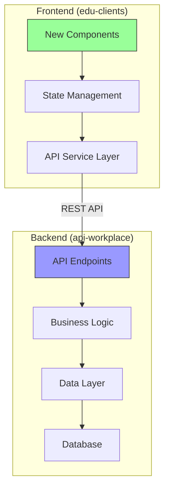
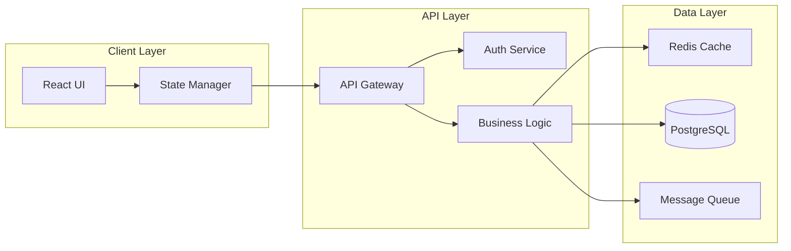
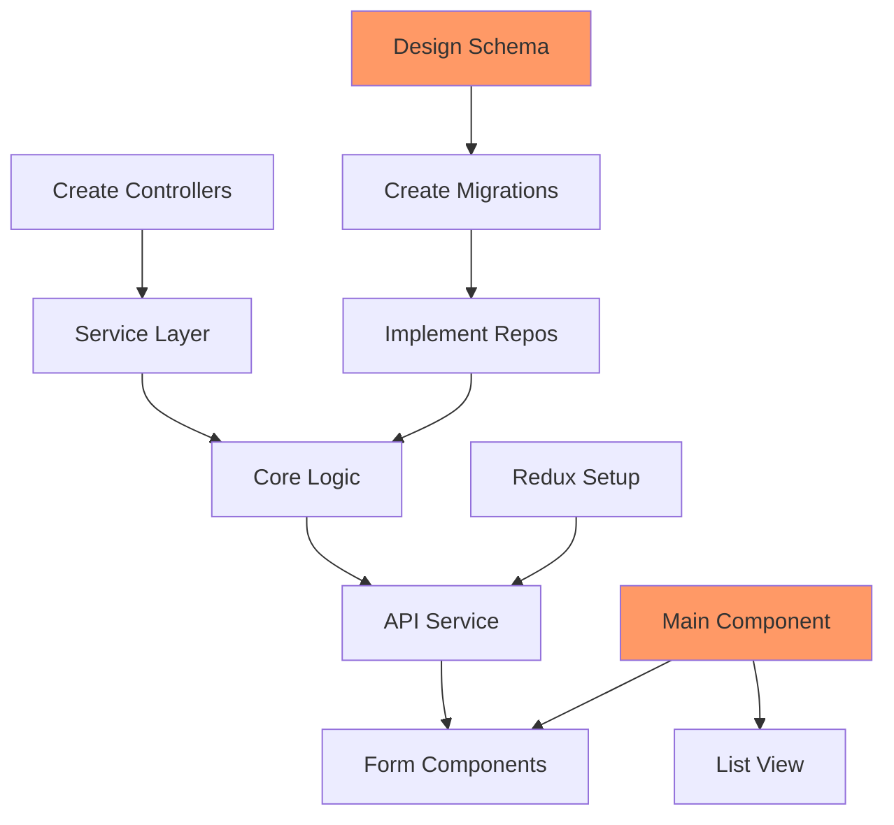

# Feature Investigation - Ultraplan Implementation Analysis

Investigate and plan the implementation of a new feature using comprehensive analysis across multiple repositories (frontend/backend), then create a detailed implementation plan in Obsidian.

**Feature Request:** $ARGUMENTS (JIRA issue key or feature description)

## Investigation Process:

### 0. **Check for Previous Feature Planning**
```bash
# Setup Obsidian vault structure and check for existing planning
OBSIDIAN_VAULT="${OBSIDIAN_VAULT:-$HOME/Documents/Obsidian/Development}"
FEATURE_ID="$ARGUMENTS"
FEATURE_DIR="${OBSIDIAN_VAULT}/features/${FEATURE_ID}"
PLAN_FILE="${FEATURE_DIR}/implementation-plan.md"
DESIGN_FILE="${FEATURE_DIR}/technical-design.md"
TASKS_FILE="${FEATURE_DIR}/task-breakdown.md"

# Check if we have previous planning for this feature
if [[ -f "$PLAN_FILE" ]]; then
    echo "🔍 Found previous planning for $FEATURE_ID"
    echo "📁 Location: $FEATURE_DIR"
    echo ""
    echo "=== Previous Planning Summary ==="
    
    # Extract key information from previous planning
    if grep -q "## Executive Summary" "$PLAN_FILE"; then
        echo "📋 Previous Analysis:"
        sed -n '/## Executive Summary/,/## Feature Details/p' "$PLAN_FILE" | head -n -1
        echo ""
    fi
    
    if grep -q "## Implementation Approach" "$PLAN_FILE"; then
        echo "🎯 Previous Implementation Strategy:"
        sed -n '/## Implementation Approach/,/## Technical Design/p' "$PLAN_FILE" | head -n -1
        echo ""
    fi
    
    # Check planning status
    LAST_MODIFIED=$(stat -f "%Sm" -t "%Y-%m-%d %H:%M" "$PLAN_FILE" 2>/dev/null || date -r "$PLAN_FILE" "+%Y-%m-%d %H:%M" 2>/dev/null || echo "Unknown")
    echo "📅 Last Planning Session: $LAST_MODIFIED"
    
    # Check if there are incomplete tasks
    if grep -q "### Sprint Planning" "$PLAN_FILE"; then
        echo "📝 Outstanding Tasks:"
        grep -A 20 "### Sprint Planning" "$PLAN_FILE" | grep "^- \[ \]" | head -5 || echo "   (All completed or none found)"
        echo ""
    fi
    
    echo "==========================================="
    echo "💭 Claude: Based on previous planning above, I can either:"
    echo "   A) Continue refining the existing plan with new insights"
    echo "   B) Start fresh planning (previous plans will be backed up)"
    echo ""
    echo "📖 Previous plan available at: $PLAN_FILE"
    echo "🏗️ Technical design available at: $DESIGN_FILE"
    echo "📝 Task breakdown available at: $TASKS_FILE"
    echo ""
    echo "🤔 Please specify how you'd like to proceed with this feature planning."
    echo ""
else
    echo "🆕 No previous planning found for $FEATURE_ID"
    echo "📁 Will create new planning at: $FEATURE_DIR"
    echo "🔍 Starting fresh feature investigation..."
    echo ""
fi
```

### 1. **Fetch Feature Details from JIRA**
```bash
# Get feature details using jira CLI if it's a JIRA ticket
if [[ "$FEATURE_ID" =~ ^[A-Z]+-[0-9]+$ ]]; then
    jira issue view "$FEATURE_ID" --output json > /tmp/feature_details.json
    
    # Extract key information
    SUMMARY=$(jq -r '.fields.summary' /tmp/feature_details.json)
    DESCRIPTION=$(jq -r '.fields.description' /tmp/feature_details.json)
    REPORTER=$(jq -r '.fields.reporter.displayName' /tmp/feature_details.json)
    CREATED=$(jq -r '.fields.created' /tmp/feature_details.json)
    PRIORITY=$(jq -r '.fields.priority.name' /tmp/feature_details.json)
    STATUS=$(jq -r '.fields.status.name' /tmp/feature_details.json)
    COMPONENTS=$(jq -r '.fields.components[].name' /tmp/feature_details.json 2>/dev/null || echo "None")
    LABELS=$(jq -r '.fields.labels[]' /tmp/feature_details.json 2>/dev/null || echo "None")
    ACCEPTANCE_CRITERIA=$(jq -r '.fields.customfield_10100' /tmp/feature_details.json 2>/dev/null || echo "To be defined")
    
    # Get comments for additional context
    jira issue comment list "$FEATURE_ID" --output json > /tmp/feature_comments.json
else
    echo "📝 Feature description provided directly (not a JIRA ticket)"
    SUMMARY="$FEATURE_ID"
    DESCRIPTION="Feature to be investigated and planned"
fi

# Determine affected repositories based on feature scope
REPOS_AFFECTED=""
if [[ "$DESCRIPTION" =~ "UI" ]] || [[ "$DESCRIPTION" =~ "frontend" ]] || [[ "$LABELS" =~ "edu-clients" ]]; then
    REPOS_AFFECTED="$REPOS_AFFECTED edu-clients"
fi
if [[ "$DESCRIPTION" =~ "API" ]] || [[ "$DESCRIPTION" =~ "backend" ]] || [[ "$LABELS" =~ "api-workplace" ]]; then
    REPOS_AFFECTED="$REPOS_AFFECTED api-workplace"
fi
```

### 2. **Feature Analysis & Scoping**
- Parse feature requirements and acceptance criteria
- Identify affected components/services (Frontend vs Backend vs Full-Stack)
- Determine user personas and use cases
- Analyze business value and impact
- Identify dependencies and constraints
- Research similar existing features in codebase

### 3. **Multi-Repository Investigation Strategy**

#### Codebase Analysis
```bash
# Check which repositories we have access to locally
CURRENT_REPO=$(basename $(git rev-parse --show-toplevel 2>/dev/null) || echo "none")
echo "Current repository: $CURRENT_REPO"

# Define repository paths (adjust based on your setup)
EDU_CLIENTS_PATH="${EDU_CLIENTS_PATH:-../edu-clients}"
API_WORKPLACE_PATH="${API_WORKPLACE_PATH:-../api-workplace}"

# Check availability
HAVE_EDU_CLIENTS=false
HAVE_API_WORKPLACE=false

if [[ -d "$EDU_CLIENTS_PATH/.git" ]]; then
    HAVE_EDU_CLIENTS=true
    echo "✓ Found edu-clients at: $EDU_CLIENTS_PATH"
fi

if [[ -d "$API_WORKPLACE_PATH/.git" ]]; then
    HAVE_API_WORKPLACE=true
    echo "✓ Found api-workplace at: $API_WORKPLACE_PATH"
fi
```

#### Implementation Research

**A. When Both Repos Are Available:**
- Search for similar features to use as templates
- Analyze existing patterns and conventions
- Check API endpoints that might be extended
- Review component libraries and design system
- Identify reusable services and utilities

**B. When Only One Repo Is Available:**
- Deep dive into available repo architecture
- For missing repo, document assumptions:
  - Expected API contracts
  - Data models needed
  - Integration points
  - Security considerations

**C. When Neither Repo Is Available:**
- Work from feature requirements
- Document needed research:
  - Architecture patterns to follow
  - Technology stack constraints
  - Performance requirements
  - Scalability considerations

### 4. **Cross-Repository Design Analysis**

#### Frontend (edu-clients) Planning:
- **User Interface**: Component hierarchy and state management
- **User Experience**: Flow diagrams and interaction patterns
- **API Integration**: Required endpoints and data contracts
- **Performance**: Loading strategies and optimizations
- **Accessibility**: WCAG compliance requirements

#### Backend (api-workplace) Planning:
- **API Design**: RESTful endpoints or GraphQL schema
- **Data Models**: Database schema and relationships
- **Business Logic**: Service layer architecture
- **Security**: Authentication and authorization
- **Performance**: Caching and query optimization

#### Integration Planning:
- **API Contract**: Request/response specifications
- **Error Handling**: Failure scenarios and recovery
- **Data Validation**: Client and server-side rules
- **Testing Strategy**: Integration test approach
- **Deployment**: Feature flags and rollout plan

### 5. **Technical Design Deep Dive**

#### Architecture Considerations
- **Scalability**: How will this feature scale?
- **Performance**: Expected load and response times
- **Security**: Threat model and mitigation
- **Maintainability**: Code organization and documentation
- **Monitoring**: Metrics and alerting needs

#### Design Patterns
- Identify applicable design patterns
- Review company/team conventions
- Consider SOLID principles
- Plan for extensibility

#### Technology Decisions
- Framework features to leverage
- Third-party libraries needed
- Build vs buy analysis
- Technical debt considerations

### 6. **Implementation Planning**

#### Phase 1: Foundation
- Core data models
- Basic API endpoints
- Minimal UI components
- Unit test structure

#### Phase 2: Core Features
- Complete business logic
- Full UI implementation
- Integration tests
- Error handling

#### Phase 3: Polish
- Performance optimization
- Enhanced UX features
- Comprehensive testing
- Documentation

#### Phase 4: Launch Preparation
- Feature flags setup
- Monitoring configuration
- Rollout planning
- Team training

### 7. **Generate/Update Obsidian Documentation**

```bash
# Vault structure already set up in step 0
mkdir -p "$FEATURE_DIR"

# If continuing from previous planning, backup existing files
if [[ -f "$PLAN_FILE" ]] && [[ "$CONTINUE_FROM_PREVIOUS" = true ]]; then
    BACKUP_DIR="${FEATURE_DIR}/backups/$(date +%Y%m%d_%H%M%S)"
    mkdir -p "$BACKUP_DIR"
    cp "$PLAN_FILE" "$BACKUP_DIR/implementation-plan.md" 2>/dev/null || true
    cp "$DESIGN_FILE" "$BACKUP_DIR/technical-design.md" 2>/dev/null || true
    cp "$TASKS_FILE" "$BACKUP_DIR/task-breakdown.md" 2>/dev/null || true
    echo "📁 Previous planning backed up to: $BACKUP_DIR"
fi
```

#### Main Implementation Plan:
```markdown
# Feature Implementation Plan: [[FEATURE_ID]]

**Feature:** [Summary]
**Planning Date:** [Date]
**Planned By:** Claude
**Priority:** [Priority]
**Target Release:** [Version/Sprint]

## Executive Summary

### Feature Overview
[Clear description of what we're building and why]

### Business Value
- **User Benefit:** [How this helps users]
- **Business Impact:** [Revenue/efficiency gains]
- **Strategic Alignment:** [How it fits company goals]

### Scope
- **In Scope:** [What we will build]
- **Out of Scope:** [What we won't build]
- **Future Considerations:** [What might come later]

## Feature Details

### User Stories
1. **As a** [user type] **I want to** [action] **so that** [benefit]
2. **As a** [user type] **I want to** [action] **so that** [benefit]

### Acceptance Criteria
- [ ] [Criterion 1]
- [ ] [Criterion 2]
- [ ] [Criterion 3]

### Success Metrics
- **Adoption:** [Target usage]
- **Performance:** [Response time goals]
- **Quality:** [Error rate targets]

## Implementation Approach

### High-Level Architecture


### Technology Stack
- **Frontend:** React, TypeScript, [libraries]
- **Backend:** Python, FastAPI, [frameworks]
- **Database:** PostgreSQL with [extensions]
- **Infrastructure:** [deployment details]

## Technical Design

### Frontend Architecture

#### Component Structure
```
edu-clients/
├── src/
│   ├── features/
│   │   └── [feature-name]/
│   │       ├── components/
│   │       ├── hooks/
│   │       ├── services/
│   │       ├── types/
│   │       └── tests/
```

#### State Management
- **Local State:** [Component state needs]
- **Global State:** [Redux/Context needs]
- **Server State:** [React Query/SWR usage]

### Backend Architecture

#### API Design
```yaml
# OpenAPI Specification Preview
paths:
  /api/v1/[feature]:
    get:
      summary: [Description]
      parameters: [...]
    post:
      summary: [Description]
      requestBody: [...]
```

#### Data Models
```python
# Example model structure
class FeatureModel(BaseModel):
    id: UUID
    name: str
    created_at: datetime
    # ... additional fields
```

### Integration Points

#### API Contract
```typescript
// Request/Response types
interface FeatureRequest {
  // fields
}

interface FeatureResponse {
  // fields
}
```

## Implementation Phases

### Phase 1: Foundation (Week 1-2)
- [ ] Design database schema
- [ ] Create API endpoints skeleton
- [ ] Setup frontend routing
- [ ] Implement basic data models
- [ ] Write initial unit tests

### Phase 2: Core Features (Week 3-4)
- [ ] Complete API business logic
- [ ] Build main UI components
- [ ] Implement state management
- [ ] Add integration tests
- [ ] Setup error handling

### Phase 3: Enhancement (Week 5-6)
- [ ] Add advanced features
- [ ] Optimize performance
- [ ] Implement caching
- [ ] Complete E2E tests
- [ ] Write documentation

### Phase 4: Launch Prep (Week 7-8)
- [ ] Feature flag configuration
- [ ] Load testing
- [ ] Security review
- [ ] Deployment planning
- [ ] Team training

## Risk Analysis

### Technical Risks
| Risk | Probability | Impact | Mitigation |
|------|-------------|--------|------------|
| Performance issues | Medium | High | Early load testing |
| Integration complexity | High | Medium | Incremental integration |
| Data migration | Low | High | Reversible migrations |

### Dependencies
- [ ] Design system components ready
- [ ] API rate limits increased
- [ ] Database capacity verified
- [ ] Third-party service contracts

## Testing Strategy

### Test Coverage Goals
- **Unit Tests:** 90% coverage
- **Integration Tests:** All API endpoints
- **E2E Tests:** Critical user flows

### Test Plan
1. **Unit Testing**
   - Frontend components
   - Backend services
   - Utility functions

2. **Integration Testing**
   - API contract validation
   - Database operations
   - External service mocks

3. **E2E Testing**
   - Happy path scenarios
   - Error scenarios
   - Performance scenarios

## Rollout Strategy

### Feature Flags
```javascript
// Feature flag configuration
{
  "feature-name": {
    "enabled": false,
    "rolloutPercentage": 0,
    "allowedUsers": ["beta-testers"]
  }
}
```

### Rollout Phases
1. **Internal Testing:** Dev team only
2. **Beta Release:** 5% of users
3. **Gradual Rollout:** 25%, 50%, 75%
4. **Full Release:** 100% availability

## Monitoring & Metrics

### Key Metrics
- **Usage:** Feature adoption rate
- **Performance:** P95 response time
- **Errors:** Error rate by endpoint
- **Business:** Conversion impact

### Dashboards
- [ ] Create Grafana dashboard
- [ ] Setup Sentry alerts
- [ ] Configure PagerDuty
- [ ] Define SLOs

## Documentation Plan

### Technical Documentation
- [ ] API documentation
- [ ] Architecture diagrams
- [ ] Database schema
- [ ] Deployment guide

### User Documentation
- [ ] Feature guide
- [ ] Video tutorials
- [ ] FAQ section
- [ ] Release notes

## Sprint Planning

### Sprint 1 Tasks
- [ ] Database design review
- [ ] API endpoint scaffolding
- [ ] Frontend component prototypes
- [ ] Testing framework setup

### Sprint 2 Tasks
- [ ] Core business logic
- [ ] UI implementation
- [ ] Integration development
- [ ] Initial testing

### Sprint 3 Tasks
- [ ] Feature completion
- [ ] Performance optimization
- [ ] Documentation
- [ ] Deployment preparation

## Team Responsibilities

### Frontend Team
- **Lead:** [Name]
- **Developers:** [Names]
- **Deliverables:** UI components, state management

### Backend Team
- **Lead:** [Name]
- **Developers:** [Names]
- **Deliverables:** API endpoints, business logic

### QA Team
- **Lead:** [Name]
- **Testers:** [Names]
- **Deliverables:** Test plans, automation

## Success Criteria

### Definition of Done
- [ ] All acceptance criteria met
- [ ] Code review completed
- [ ] Tests passing (unit, integration, E2E)
- [ ] Documentation complete
- [ ] Performance benchmarks met
- [ ] Security review passed

### Launch Criteria
- [ ] Feature flag tested
- [ ] Monitoring in place
- [ ] Rollback plan documented
- [ ] Team trained
- [ ] Support prepared

## Related Resources
- Design mockups: [[Feature-Design-Mockups]]
- API specs: [[Feature-API-Specification]]
- Test plans: [[Feature-Test-Plans]]
- Previous features: [[Similar-Feature-1]], [[Similar-Feature-2]]

---

**Planning Complete:** [Date/Time]
**Next Review:** [Date]
**Implementation Start:** [Date]
```

#### Technical Design Document:
```markdown
# Technical Design: [[FEATURE_ID]]

## System Architecture

### Component Diagram


### Sequence Diagrams
[Detailed interaction flows]

### Data Flow
[How data moves through the system]

## API Specification

### Endpoints
[Detailed endpoint documentation]

### Data Models
[Complete schema definitions]

### Error Handling
[Error codes and responses]

## Security Design

### Authentication
[Auth flow and token management]

### Authorization
[Permission model and checks]

### Data Protection
[Encryption and privacy measures]

## Performance Design

### Caching Strategy
[What to cache and TTLs]

### Database Optimization
[Indexes and query optimization]

### Load Handling
[Scaling approach]

## Deployment Architecture

### Infrastructure
[Cloud resources needed]

### CI/CD Pipeline
[Build and deploy process]

### Monitoring Setup
[Metrics and alerting]
```

#### Task Breakdown:
```markdown
# Task Breakdown: [[FEATURE_ID]]

## Epic: [Feature Name]

### Frontend Tasks

#### Components Development
- [ ] FE-001: Create main feature component (3 pts)
- [ ] FE-002: Build form components (2 pts)
- [ ] FE-003: Implement list view (2 pts)
- [ ] FE-004: Add detail view (2 pts)
- [ ] FE-005: Create modal dialogs (1 pt)

#### State Management
- [ ] FE-006: Setup Redux slices (2 pts)
- [ ] FE-007: Implement selectors (1 pt)
- [ ] FE-008: Add middleware (2 pts)

#### API Integration
- [ ] FE-009: Create API service layer (2 pts)
- [ ] FE-010: Implement error handling (2 pts)
- [ ] FE-011: Add retry logic (1 pt)

#### Testing
- [ ] FE-012: Unit tests for components (3 pts)
- [ ] FE-013: Integration tests (2 pts)
- [ ] FE-014: E2E test scenarios (3 pts)

### Backend Tasks

#### API Development
- [ ] BE-001: Create endpoint controllers (3 pts)
- [ ] BE-002: Implement service layer (3 pts)
- [ ] BE-003: Add validation logic (2 pts)
- [ ] BE-004: Setup error responses (1 pt)

#### Database
- [ ] BE-005: Design schema (2 pts)
- [ ] BE-006: Create migrations (1 pt)
- [ ] BE-007: Add indexes (1 pt)
- [ ] BE-008: Implement repositories (2 pts)

#### Business Logic
- [ ] BE-009: Core feature logic (5 pts)
- [ ] BE-010: Permission checks (2 pts)
- [ ] BE-011: Data transformations (2 pts)

#### Testing
- [ ] BE-012: Unit tests (3 pts)
- [ ] BE-013: Integration tests (3 pts)
- [ ] BE-014: Performance tests (2 pts)

### DevOps Tasks

#### Infrastructure
- [ ] DO-001: Setup feature flags (1 pt)
- [ ] DO-002: Configure monitoring (2 pts)
- [ ] DO-003: Create dashboards (2 pts)

#### Deployment
- [ ] DO-004: Update CI/CD pipeline (2 pts)
- [ ] DO-005: Create rollback plan (1 pt)
- [ ] DO-006: Load test environment (3 pts)

### Documentation Tasks
- [ ] DOC-001: API documentation (2 pts)
- [ ] DOC-002: User guide (3 pts)
- [ ] DOC-003: Technical docs (2 pts)
- [ ] DOC-004: Release notes (1 pt)

## Task Dependencies



## Story Point Summary
- **Frontend:** 28 points
- **Backend:** 29 points  
- **DevOps:** 11 points
- **Documentation:** 8 points
- **Total:** 76 points

## Sprint Allocation
- **Sprint 1:** 26 points (Foundation)
- **Sprint 2:** 25 points (Core Development)
- **Sprint 3:** 25 points (Polish & Testing)
```

### 8. **Create Visual Diagrams**
Generate Excalidraw diagrams for:
- Feature architecture overview
- User flow diagrams
- Component hierarchy
- API sequence diagrams
- Deployment topology

## Example Usage:
```
Command: atm-feature-investigation PROJ-5678

Output:
🆕 No previous planning found for PROJ-5678
📁 Will create new planning at: ~/Documents/Obsidian/Development/features/PROJ-5678
🔍 Starting fresh feature investigation...

Fetching feature details from JIRA...
✓ Feature retrieved: "Add real-time collaboration to document editor"
✓ Priority: High
✓ Components: Frontend, API, WebSocket
✓ Affected repos: edu-clients, api-workplace

Checking repository access...
✓ Current repo: edu-clients
✓ Found edu-clients at: /Users/dev/edu-clients
✓ Found api-workplace at: /Users/dev/api-workplace

Analyzing codebase for similar features...
✓ Found WebSocket service: src/services/websocket.ts
✓ Found editor component: src/components/Editor/index.tsx
✓ Found collaboration examples in: src/features/chat

Backend analysis...
✓ WebSocket handler: api/websocket/handler.py
✓ Redis pub/sub available for real-time
✓ Existing document model found

Creating implementation plan...

Feature Breakdown:
- Frontend: Real-time cursor tracking, conflict resolution
- Backend: WebSocket rooms, operational transform
- Infrastructure: Redis pub/sub, horizontal scaling

Technical Approach:
- Use existing WebSocket infrastructure
- Implement CRDT for conflict-free editing
- Add presence awareness system
- Create collaborative undo/redo

Implementation Phases:
1. Foundation (2 weeks)
   - WebSocket room management
   - Basic cursor tracking
   - Simple text synchronization

2. Core Features (3 weeks)
   - Operational transform implementation
   - Conflict resolution
   - Presence indicators
   - User awareness

3. Polish (2 weeks)
   - Performance optimization
   - Offline support
   - Enhanced UX features

4. Launch (1 week)
   - Feature flag setup
   - Monitoring
   - Gradual rollout

Estimated effort: 8 weeks (2 frontend, 2 backend devs)

Generating documentation...
✓ Implementation plan: ~/Documents/Obsidian/Development/features/PROJ-5678/implementation-plan.md
✓ Technical design: ~/Documents/Obsidian/Development/features/PROJ-5678/technical-design.md
✓ Task breakdown: ~/Documents/Obsidian/Development/features/PROJ-5678/task-breakdown.md
✓ Architecture diagram: ~/Documents/Obsidian/Development/features/PROJ-5678/architecture.excalidraw

Summary:
- Feature type: Full-stack with real-time components
- Complexity: High (WebSocket, conflict resolution)
- Team needed: 2 FE, 2 BE, 1 DevOps
- Timeline: 8 weeks
- Major risks: Scaling WebSocket connections
- Dependencies: Redis cluster upgrade needed

View complete plan in Obsidian vault.
```

## Notes:
- Focuses on planning new features rather than investigating bugs
- Includes comprehensive technical design documentation
- Creates detailed task breakdowns with story points
- Handles multi-repository feature planning
- Includes architecture diagrams and user flows
- Provides phased implementation approach
- Includes risk analysis and mitigation strategies
- Creates sprint planning and team allocation
- Generates monitoring and rollout strategies
- Links to design mockups and specifications
- Provides clear success criteria and DoD