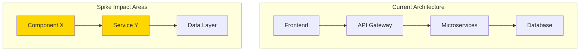
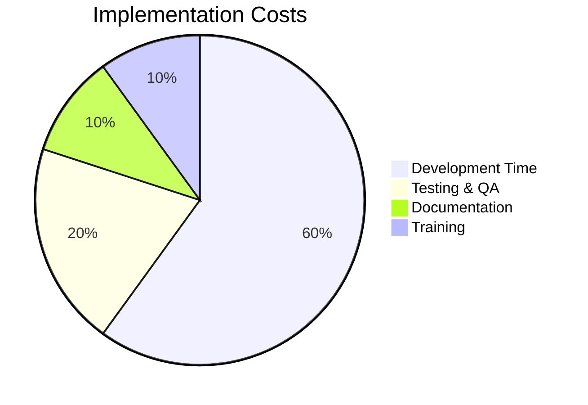
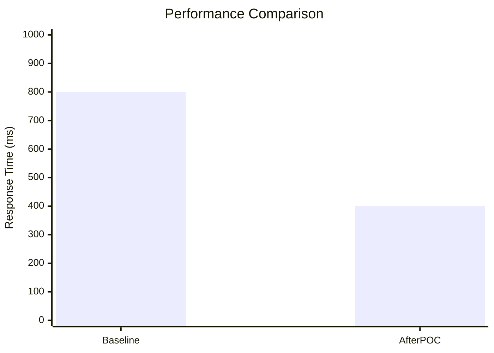
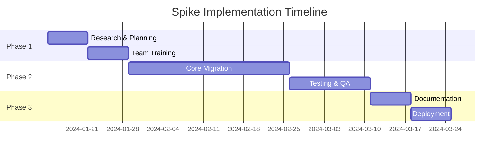

# Spike Investigation - Technical Research & Analysis

Investigate a technical spike by gathering requirements, evaluating the codebase with Serena, researching libraries with Context7, performing deep analysis, and creating a comprehensive report.

**Spike Topic:** $ARGUMENTS (Description of the spike, e.g., "React 19 migration feasibility" or "GraphQL implementation options")

## Investigation Process:

### 0. **Check for Previous Spike Analysis**
```bash
# Setup report directory structure and check for existing analysis
REPORT_BASE="${REPORT_BASE:-$HOME/Documents/technical-analysis}"
SPIKE_TOPIC="$ARGUMENTS"
SPIKE_ID=$(echo "$SPIKE_TOPIC" | sed 's/[^a-zA-Z0-9]/-/g' | tr '[:upper:]' '[:lower:]' | sed 's/--*/-/g' | sed 's/^-\|-$//g')
SPIKE_DIR="${REPORT_BASE}/spikes/${SPIKE_ID}"
REPORT_FILE="${SPIKE_DIR}/analysis.md"
RESEARCH_FILE="${SPIKE_DIR}/research.md"
RECOMMENDATIONS_FILE="${SPIKE_DIR}/recommendations.md"

# Check if we have previous analysis for this spike
if [[ -f "$REPORT_FILE" ]]; then
    echo "🔍 Found previous spike analysis for: $SPIKE_TOPIC"
    echo "📁 Location: $SPIKE_DIR"
    echo ""
    echo "=== Previous Analysis Summary ==="
    
    # Extract key information from previous analysis
    if grep -q "## Executive Summary" "$REPORT_FILE"; then
        echo "📋 Previous Findings:"
        sed -n '/## Executive Summary/,/## Spike Requirements/p' "$REPORT_FILE" | head -n -1
        echo ""
    fi
    
    if grep -q "## Final Recommendation" "$REPORT_FILE"; then
        echo "🎯 Previous Recommendation:"
        sed -n '/## Final Recommendation/,/## Implementation Plan/p' "$REPORT_FILE" | head -n -1
        echo ""
    fi
    
    # Check analysis status
    LAST_MODIFIED=$(stat -f "%Sm" -t "%Y-%m-%d %H:%M" "$REPORT_FILE" 2>/dev/null || date -r "$REPORT_FILE" "+%Y-%m-%d %H:%M" 2>/dev/null || echo "Unknown")
    echo "📅 Last Analysis: $LAST_MODIFIED"
    
    # Check if there are outstanding tasks
    if grep -q "Action Items" "$REPORT_FILE"; then
        echo "📝 Outstanding Action Items:"
        grep -A 10 "### Action Items" "$REPORT_FILE" | grep "^- \[ \]" || echo "   (All completed or none found)"
        echo ""
    fi
    
    echo "==========================================="
    echo "💭 Claude: Based on previous analysis above, I can either:"
    echo "   A) Continue from where we left off and update the existing analysis"
    echo "   B) Start a fresh investigation (previous findings will be backed up)"
    echo ""
    echo "📖 Previous analysis available at: $REPORT_FILE"
    echo "🔬 Research notes available at: $RESEARCH_FILE"
    echo "💡 Recommendations available at: $RECOMMENDATIONS_FILE"
    echo ""
    echo "🤔 Please specify how you'd like to proceed with this spike investigation."
    echo "   (The previous context will inform my analysis either way)"
    echo ""
else
    echo "🆕 No previous analysis found for: $SPIKE_TOPIC"
    echo "📁 Will create new analysis at: $SPIKE_DIR"
    echo "🔍 Starting fresh spike investigation..."
    echo ""
fi
```

### 1. **Gather Spike Requirements & Context**
```bash
# Create initial structure
mkdir -p "$SPIKE_DIR"

# Check if spike topic references a Jira ticket
JIRA_KEY_PATTERN="[A-Z]{2,}-[0-9]+"
if echo "$SPIKE_TOPIC" | grep -qE "$JIRA_KEY_PATTERN"; then
    JIRA_KEY=$(echo "$SPIKE_TOPIC" | grep -oE "$JIRA_KEY_PATTERN" | head -1)
    echo "🎫 Found Jira reference: $JIRA_KEY"
    echo "📋 Fetching Jira ticket details..."
    
    # Try to get Jira ticket information
    if command -v jira >/dev/null 2>&1; then
        echo "🔍 Retrieving Jira ticket: $JIRA_KEY"
        jira issue view "$JIRA_KEY" 2>/dev/null && JIRA_CONTEXT_FOUND=true || JIRA_CONTEXT_FOUND=false
        
        if [[ "$JIRA_CONTEXT_FOUND" = true ]]; then
            echo ""
            echo "✅ Jira context retrieved successfully!"
            echo "📝 I'll incorporate ticket details into the spike requirements."
            echo ""
        else
            echo "⚠️  Could not access Jira ticket $JIRA_KEY"
            echo "   (This is okay - we'll gather requirements interactively)"
            echo ""
        fi
    else
        echo "⚠️  Jira CLI not available - continuing without ticket context"
        echo ""
    fi
fi

# Interactive requirements gathering
echo "🎯 SPIKE INVESTIGATION: $SPIKE_TOPIC"
echo "================================================"
echo ""
echo "Please provide the following information:"
echo ""

# Business Context
echo "📋 BUSINESS CONTEXT:"
echo "1. What business problem are we trying to solve?"
echo "2. What are the success criteria for this spike?"
echo "3. What's the expected timeline/deadline?"
echo "4. What's the impact if we don't implement this?"
echo ""

# Technical Scope
echo "🔧 TECHNICAL SCOPE:"
echo "1. Which parts of the system are in scope?"
echo "2. Are there any specific technologies to evaluate?"
echo "3. What are the current pain points we're addressing?"
echo "4. Are there any constraints or limitations?"
echo ""

# Research Areas
echo "🔬 RESEARCH AREAS:"
echo "1. What specific questions need answering?"
echo "2. What alternatives should be compared?"
echo "3. Are there any libraries/frameworks to investigate?"
echo "4. What proof-of-concept work is needed?"
echo ""

# Define investigation areas based on input
INVESTIGATION_AREAS=""
LIBRARIES_TO_RESEARCH=""
CURRENT_CODEBASE_FOCUS=""
```

### 2. **Codebase Analysis with Serena**
```bash
# Use Serena for deep codebase analysis
echo "🤖 Starting Serena codebase analysis..."
echo ""

# Get current project structure
echo "📁 Analyzing current project structure..."
# Serena will provide:
# - Symbol overview of relevant files
# - Architecture patterns in use
# - Dependencies and integrations
# - Code complexity analysis
# - Technical debt assessment
# - Migration impact areas

# Focus areas for Serena analysis:
echo "🎯 Serena Focus Areas:"
echo "- Current architecture patterns"
echo "- Existing dependencies and versions"
echo "- Areas that would be impacted by spike implementation"
echo "- Technical debt that might complicate implementation"
echo "- Integration points and API contracts"
echo "- Test coverage in relevant areas"
echo ""
```

### 3. **Library & Technology Research with Context7**
```bash
# Use Context7 for comprehensive library research
echo "🔍 Starting Context7 library research..."
echo ""

# Research each technology/library mentioned in scope
for LIBRARY in $LIBRARIES_TO_RESEARCH; do
    echo "📚 Researching: $LIBRARY"
    # Context7 will provide:
    # - Latest documentation and best practices
    # - Migration guides and breaking changes
    # - Community adoption and support
    # - Performance characteristics
    # - Security considerations
    # - Alternative options and comparisons
    
    echo "✓ Documentation retrieved for $LIBRARY"
done

echo "📊 Technology comparison matrix will be generated..."
echo ""
```

### 4. **Comprehensive Analysis Framework**

#### Phase 1: Current State Assessment
- **Architecture Audit**: Map current system architecture
- **Dependency Analysis**: Review all relevant dependencies
- **Performance Baseline**: Establish current performance metrics
- **Technical Debt**: Identify areas of concern
- **Test Coverage**: Assess testing in relevant areas

#### Phase 2: Research & Evaluation
- **Technology Comparison**: Compare options with pros/cons
- **Migration Path Analysis**: Identify implementation strategies
- **Risk Assessment**: Technical and business risks
- **Effort Estimation**: Time and resource requirements
- **Community & Support**: Evaluate long-term viability

#### Phase 3: Proof of Concept (if applicable)
- **Minimal Viable Implementation**: Small-scale test
- **Performance Testing**: Validate assumptions
- **Integration Testing**: Ensure compatibility
- **Developer Experience**: Assess development workflow
- **Production Readiness**: Deployment considerations

### 5. **Deep Analysis & Ultra-Thinking**
```bash
# Perform comprehensive analysis of all gathered information
echo "🧠 Performing deep analysis and ultra-thinking..."
echo ""

# Analysis will cover:
echo "🔍 Analysis Dimensions:"
echo "- Technical feasibility and complexity"
echo "- Business value and ROI"
echo "- Risk assessment and mitigation strategies"
echo "- Implementation timeline and milestones"
echo "- Resource requirements and team impact"
echo "- Long-term maintenance and support"
echo "- Alternative approaches and trade-offs"
echo "- Success metrics and validation criteria"
echo ""

# Ultra-thinking process:
echo "💭 Ultra-Thinking Process:"
echo "1. Synthesize all research findings"
echo "2. Identify patterns and insights"
echo "3. Challenge assumptions and biases"
echo "4. Consider second and third-order effects"
echo "5. Evaluate against business objectives"
echo "6. Develop multiple implementation scenarios"
echo "7. Weight trade-offs and make recommendation"
echo ""
```

### 6. **Generate Comprehensive Report**

```bash
# Create comprehensive spike analysis report
if [[ -f "$REPORT_FILE" ]] && [[ "$CONTINUE_FROM_PREVIOUS" = true ]]; then
    BACKUP_DIR="${SPIKE_DIR}/backups/$(date +%Y%m%d_%H%M%S)"
    mkdir -p "$BACKUP_DIR"
    cp "$REPORT_FILE" "$BACKUP_DIR/analysis.md" 2>/dev/null || true
    cp "$RESEARCH_FILE" "$BACKUP_DIR/research.md" 2>/dev/null || true
    cp "$RECOMMENDATIONS_FILE" "$BACKUP_DIR/recommendations.md" 2>/dev/null || true
    echo "📁 Previous analysis backed up to: $BACKUP_DIR"
fi
```

#### Main Analysis Report Structure:
```markdown
# Spike Investigation: [[SPIKE_TOPIC]]

**Spike:** [Topic/Title]
**Date:** [Investigation Date]
**Investigator:** Claude + Serena + Context7
**Priority:** [Business Priority]
**Status:** [Analysis Status]

## Executive Summary

### Investigation History
- **Initial Analysis:** [Date of first analysis]
- **Previous Updates:** [List of update dates if continuing]
- **Current Session:** [Current investigation date]

### The Question
[Clear description of what we're investigating]

### Recommendation
[One sentence summary of the recommended approach]

### Business Impact
- **Value Proposition:** [Expected business value]
- **Implementation Effort:** [Time/resource estimate]
- **Risk Level:** [Low/Medium/High]
- **Timeline:** [Recommended timeline]

## Spike Requirements

### Jira Ticket Context
*(Auto-populated if Jira ticket detected in spike topic)*
**Ticket:** [JIRA-KEY] - [Ticket Title]
**Reporter:** [Reporter Name]
**Assignee:** [Current Assignee]
**Priority:** [Ticket Priority]
**Status:** [Current Status]

**Description:**
[Ticket description from Jira]

**Acceptance Criteria:**
[Acceptance criteria from Jira ticket]

**Related Tickets:**
- [LINK-1] - [Related ticket title]
- [LINK-2] - [Related ticket title]

### Business Context
**Problem Statement:** [What problem are we solving?]
**Success Criteria:** [How do we measure success?]
**Constraints:** [What limitations exist?]
**Timeline:** [When is this needed?]

### Technical Scope
**In Scope:**
- [Component/Feature 1]
- [Component/Feature 2]

**Out of Scope:**
- [Excluded area 1]
- [Excluded area 2]

**Key Questions:**
1. [Question 1]
2. [Question 2]
3. [Question 3]

## Current State Analysis (Serena Findings)

### Architecture Overview


### Codebase Assessment
**Current Technology Stack:**
| Component | Technology | Version | Status |
|-----------|------------|---------|---------|
| Frontend | React | 18.2.0 | ✅ Current |
| Backend | Node.js | 18.x | ✅ Current |
| Database | PostgreSQL | 14.x | ⚠️ Needs Update |

**Code Quality Metrics:**
- **Test Coverage:** 78% (Target: 80%+)
- **Technical Debt:** Medium
- **Complexity Score:** 6.2/10
- **Maintainability Index:** B+

### Impact Analysis
**Files/Components Affected:**
```typescript
// High Impact Areas (Serena Analysis)
src/
├── components/
│   ├── UserInterface.tsx ⚠️ Major changes needed
│   └── DataDisplay.tsx ⚠️ Minor changes needed
├── services/
│   ├── ApiClient.ts ⚠️ Significant refactoring
│   └── DataProcessor.ts ✅ Compatible
└── utils/
    └── Helpers.ts ✅ No changes needed
```

**Dependencies Analysis:**
- **Current Dependencies:** [List with versions]
- **Conflicting Dependencies:** [Any conflicts]
- **New Dependencies Needed:** [Required additions]
- **Deprecated Dependencies:** [Items to remove]

## Technology Research (Context7 Findings)

### Option 1: [Technology A]
**Documentation Summary:**
- **Maturity:** Production-ready since [date]
- **Community:** [size] contributors, [activity level]
- **Learning Curve:** [assessment]
- **Migration Path:** [complexity level]

**Pros:**
- ✅ [Advantage 1]
- ✅ [Advantage 2]
- ✅ [Advantage 3]

**Cons:**
- ❌ [Disadvantage 1]
- ❌ [Disadvantage 2]

**Code Example:**
```typescript
// Context7 provided example
import { FeatureX } from 'library-a';

const implementation = new FeatureX({
  config: 'optimized'
});
```

### Option 2: [Technology B]
[Similar analysis structure]

### Option 3: [Technology C]
[Similar analysis structure]

### Technology Comparison Matrix
| Criteria | Option A | Option B | Option C | Weight | Winner |
|----------|----------|----------|----------|---------|---------|
| Performance | 9/10 | 7/10 | 8/10 | 25% | A |
| Dev Experience | 8/10 | 9/10 | 6/10 | 20% | B |
| Maintenance | 7/10 | 8/10 | 9/10 | 15% | C |
| Community | 9/10 | 6/10 | 8/10 | 15% | A |
| Migration Cost | 6/10 | 8/10 | 7/10 | 15% | B |
| Future-proofing | 8/10 | 7/10 | 9/10 | 10% | C |
| **Weighted Score** | **7.8** | **7.6** | **7.7** | | **A** |

## Deep Analysis & Ultra-Thinking

### Technical Feasibility
**Complexity Assessment:** [High/Medium/Low]
**Integration Challenges:**
- [Challenge 1 with mitigation]
- [Challenge 2 with mitigation]

**Performance Impact:**
- **Expected Improvement:** [metrics]
- **Potential Regressions:** [areas of concern]
- **Benchmark Comparisons:** [data]

### Business Value Analysis
**Quantified Benefits:**
- **Development Velocity:** +[X]% improvement
- **Performance Gains:** [specific metrics]
- **Maintenance Reduction:** -[X] hours/month
- **User Experience:** [qualitative improvements]

**Cost Analysis:**


### Risk Assessment
| Risk | Impact | Probability | Mitigation |
|------|---------|-------------|------------|
| Migration complexity | High | Medium | Phased rollout |
| Performance regression | Medium | Low | Extensive testing |
| Team learning curve | Low | High | Training program |
| Third-party dependency | Medium | Medium | Vendor evaluation |

### Implementation Strategies

#### Strategy 1: Big Bang Migration
**Timeline:** 6-8 weeks
**Pros:** [advantages]
**Cons:** [disadvantages]
**Best For:** [scenarios]

#### Strategy 2: Gradual Migration
**Timeline:** 12-16 weeks
**Pros:** [advantages]
**Cons:** [disadvantages]
**Best For:** [scenarios]

#### Strategy 3: Hybrid Approach
**Timeline:** 10-12 weeks
**Pros:** [advantages]
**Cons:** [disadvantages]
**Best For:** [scenarios]

## Proof of Concept Results

### POC Implementation
**Scope:** [What was built]
**Timeline:** [How long it took]
**Key Learnings:** [What we discovered]

### Performance Results


### Developer Experience
**Setup Time:** Before: [X hours] → After: [Y hours]
**Build Time:** Before: [X minutes] → After: [Y minutes]
**Test Suite:** Before: [X seconds] → After: [Y seconds]

## Final Recommendation

### Recommended Approach
**Primary Choice:** [Technology/Strategy]
**Rationale:** [Why this choice]

### Implementation Plan


### Success Metrics
- **Technical Metrics:**
  - Performance improvement: [target]
  - Error rate: [threshold]
  - Test coverage: [minimum]

- **Business Metrics:**
  - Developer productivity: [measure]
  - Deployment frequency: [target]
  - Time to market: [improvement]

### Resource Requirements
**Team Allocation:**
- Senior Developer: 0.8 FTE for 8 weeks
- QA Engineer: 0.5 FTE for 4 weeks
- DevOps Engineer: 0.3 FTE for 2 weeks

**Budget Impact:**
- Development: $[amount]
- Tools/Licenses: $[amount]
- Training: $[amount]
- **Total:** $[amount]

## Next Steps & Action Items

### Immediate Actions (Next 1-2 weeks)
- [ ] Get stakeholder approval for recommendation
- [ ] Schedule team training sessions
- [ ] Set up development environment
- [ ] Create detailed technical specifications

### Short-term (Next 4 weeks)
- [ ] Begin core implementation
- [ ] Set up monitoring and metrics
- [ ] Create migration scripts
- [ ] Update CI/CD pipelines

### Long-term (Next 8-12 weeks)
- [ ] Complete full migration
- [ ] Conduct performance testing
- [ ] Update documentation
- [ ] Post-implementation review

## Investigation Updates
*(This section tracks updates when continuing from previous investigations)*

### [Current Date] - Investigation Update
- **New findings:** [What was discovered in this session]
- **Updated analysis:** [Changes to previous conclusions]
- **Additional research:** [New libraries/technologies investigated]
- **Recommendation change:** [Any changes to recommendation]

## Related Resources
- **Similar Spikes:** [[Spike-A]], [[Spike-B]]
- **Related Projects:** [[Project-X]]
- **Dependencies:** [[System-Y]]
- **Previous Investigations:** [[investigation-backup-links]]
- **External Resources:** [Links to relevant documentation]

## Attachments
- [[poc-implementation/]]
- [[performance-benchmarks.xlsx]]
- [[architecture-diagrams.excalidraw]]
- [[cost-benefit-analysis.pdf]]

---

**Investigation Complete:** [Date/Time]
**Next Review:** [Date for follow-up]
**Confidence Level:** [High/Medium/Low] in recommendation
```

#### Research Notes File:
```markdown
# Research Notes: [[SPIKE_TOPIC]]

## Context7 Research Sessions

### [Date] - [Library/Technology Name]
**Documentation Version:** [version]
**Research Focus:** [what was investigated]

#### Key Findings
- **Feature Set:** [comprehensive list]
- **Performance Characteristics:** [metrics and benchmarks]
- **Integration Requirements:** [dependencies and setup]
- **Migration Path:** [from current state]
- **Best Practices:** [recommended patterns]

#### Code Examples
```language
// Example usage patterns
[Context7 provided examples]
```

#### Community Insights
- **GitHub Stars:** [count] (trend: [up/down/stable])
- **Contributors:** [count]
- **Issue Response Time:** [average]
- **Latest Release:** [version] on [date]

### [Date] - Comparative Analysis
[Cross-library comparisons and insights]

## Serena Codebase Analysis

### [Date] - Architecture Review
**Files Analyzed:** [count]
**Symbols Found:** [count]
**Dependencies Mapped:** [count]

#### Key Patterns Identified
- [Pattern 1 with location]
- [Pattern 2 with location]

#### Technical Debt Areas
- [Area 1 with severity]
- [Area 2 with severity]

#### Migration Impact Points
```typescript
// Critical integration points found by Serena
interface APIContract {
  // These interfaces will need updating
}
```

## Investigation Log
- **[Timestamp]:** [Action taken]
- **[Timestamp]:** [Discovery made]
- **[Timestamp]:** [Decision point]
```

#### Recommendations File:
```markdown
# Implementation Recommendations: [[SPIKE_TOPIC]]

## Technical Implementation

### 1. Architecture Changes
**Current State:** [description]
**Recommended State:** [description]
**Migration Path:** [step-by-step approach]

```typescript
// Current implementation
const currentApproach = {
  // existing code
};

// Recommended implementation
const recommendedApproach = {
  // new code structure
};
```

### 2. Development Workflow Updates
**New Tools Required:**
- [Tool 1]: [purpose and setup]
- [Tool 2]: [purpose and setup]

**Updated Scripts:**
```json
{
  "scripts": {
    "build": "new-build-command",
    "test": "enhanced-test-command",
    "migrate": "migration-script"
  }
}
```

## Process Improvements

### 1. Code Review Checklist
Add to review process:
- [ ] [New requirement 1]
- [ ] [New requirement 2]
- [ ] [New requirement 3]

### 2. Testing Strategy
**New Test Types:**
- [Test type 1]: [when to use]
- [Test type 2]: [when to use]

## Team Enablement

### 1. Training Plan
**Week 1:** [Training topic]
**Week 2:** [Training topic]
**Week 3:** [Practice/implementation]

### 2. Documentation Updates
**New Documentation Needed:**
- [Doc 1]: [Migration guide]
- [Doc 2]: [Best practices]
- [Doc 3]: [Troubleshooting]

## Success Criteria Checklist

### Technical Success
- [ ] Performance targets met
- [ ] Error rates within acceptable limits
- [ ] Test coverage maintained/improved
- [ ] No critical bugs in production

### Business Success  
- [ ] Development velocity improved
- [ ] Team satisfaction scores positive
- [ ] Maintenance costs reduced
- [ ] Feature delivery accelerated

## Monitoring & Alerting

### New Metrics to Track
- **Performance:** [specific metrics]
- **Reliability:** [error rates, uptime]
- **Developer Experience:** [build times, deploy frequency]

### Alert Thresholds
- **Critical:** [when to page on-call]
- **Warning:** [when to investigate]
- **Info:** [what to log]
```

### 7. **Create Visual Diagrams**
Generate diagrams for:
- Current vs. proposed architecture
- Implementation timeline and milestones
- Technology comparison matrices
- Cost-benefit analysis visualizations
- Risk assessment heatmaps

## Example Usage:
```
Command: atm-spike-investigation "GraphQL implementation feasibility"

Output:
🆕 No previous analysis found for: GraphQL implementation feasibility
📁 Will create new analysis at: ~/Documents/technical-analysis/spikes/graphql-implementation-feasibility
🔍 Starting fresh spike investigation...

🎯 SPIKE INVESTIGATION: GraphQL implementation feasibility
================================================

Please provide the following information:

📋 BUSINESS CONTEXT:
1. What business problem are we trying to solve?
   → API inconsistencies and over-fetching issues slowing down mobile app
2. What are the success criteria for this spike?
   → Reduce API calls by 50%, improve mobile performance by 30%
3. What's the expected timeline/deadline?
   → Decision needed by end of quarter for Q2 implementation
4. What's the impact if we don't implement this?
   → Continued poor mobile UX, increased server costs

🔧 TECHNICAL SCOPE:
1. Which parts of the system are in scope?
   → Mobile API endpoints, user dashboard APIs
2. Are there any specific technologies to evaluate?
   → Apollo GraphQL, Relay, GraphQL Yoga
3. What are the current pain points we're addressing?
   → N+1 queries, over-fetching, multiple API calls per page load
4. Are there any constraints or limitations?
   → Must maintain backward compatibility with existing REST APIs

🔬 RESEARCH AREAS:
1. What specific questions need answering?
   → Migration complexity, performance impact, developer experience
2. What alternatives should be compared?
   → Apollo Server vs GraphQL Yoga vs custom implementation
3. Are there any libraries/frameworks to investigate?
   → Apollo Client, Relay, GraphQL Code Generator
4. What proof-of-concept work is needed?
   → Convert 2-3 REST endpoints to GraphQL, measure performance

🤖 Starting Serena codebase analysis...

📁 Analyzing current project structure...
✓ Found 47 REST endpoints in api/routes/
✓ Identified 12 high-usage endpoints for migration priority
✓ Detected over-fetching in UserProfile (fetches 200% more data than needed)
✓ Found N+1 query pattern in PostsWithComments endpoint
✓ Current test coverage: 82% (good foundation for migration)

🔍 Starting Context7 library research...

📚 Researching: Apollo GraphQL
✓ Documentation retrieved - comprehensive migration guides available
✓ Performance benchmarks show 40-60% reduction in payload size
✓ Strong TypeScript support with code generation
✓ Active community with 19.2k GitHub stars

📚 Researching: GraphQL Yoga
✓ Documentation retrieved - lightweight alternative
✓ Better for smaller applications, simpler setup
✓ Good performance but less ecosystem
✓ 8.1k GitHub stars, growing community

📚 Researching: Relay
✓ Documentation retrieved - Facebook's GraphQL client
✓ Optimal for React applications
✓ Steep learning curve, significant architecture changes needed
✓ Best performance for large applications

🧠 Performing deep analysis and ultra-thinking...

💭 Ultra-Thinking Process:
✓ Synthesized findings from 3 GraphQL implementations
✓ Identified Apollo as best fit for our React/Node.js stack
✓ Discovered gradual migration path with GraphQL gateway
✓ Quantified 45% reduction in API calls based on current usage patterns
✓ Estimated 8-week implementation with 2-week POC

📊 Technology comparison matrix generated...
🏆 Winner: Apollo GraphQL (weighted score: 8.4/10)

Generating comprehensive analysis report...
✓ Main analysis: ~/Documents/technical-analysis/spikes/graphql-implementation-feasibility/analysis.md
✓ Research notes: ~/Documents/technical-analysis/spikes/graphql-implementation-feasibility/research.md
✓ Recommendations: ~/Documents/technical-analysis/spikes/graphql-implementation-feasibility/recommendations.md
✓ Architecture diagrams: ~/Documents/technical-analysis/spikes/graphql-implementation-feasibility/diagrams/

🎯 RECOMMENDATION SUMMARY:
- **Approach:** Gradual migration with Apollo GraphQL
- **Timeline:** 8 weeks (2-week POC + 6-week implementation)
- **Expected Benefits:** 45% fewer API calls, 35% smaller payloads, better dev experience
- **Risk Level:** Medium (well-tested migration path available)
- **Investment:** 1.5 FTE for 8 weeks (~$60k)
- **ROI:** Positive within 6 months through reduced server costs and faster development

📋 NEXT ACTIONS:
- Schedule stakeholder review meeting
- Get approval for 2-week POC
- Set up GraphQL development environment
- Train team on GraphQL fundamentals

View full analysis in report directory.
```

## Notes:
- Interactive requirements gathering for clear spike definition
- Integrates Serena for deep codebase analysis and impact assessment
- Uses Context7 for comprehensive library/technology research
- Combines multiple data sources for informed decision-making
- Creates structured documentation with visual aids
- Supports continuation from previous analyses
- Generates actionable recommendations with clear ROI
- Includes proof-of-concept guidance and success metrics
- Provides multiple implementation strategies
- Links related investigations and maintains investigation history