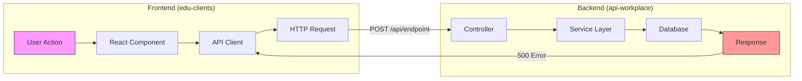
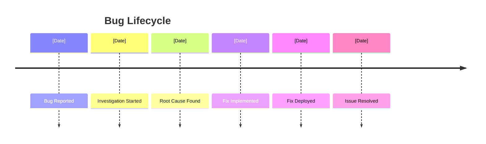

# Bug Investigation - 5 Whys Root Cause Analysis

Investigate a JIRA bug using the 5 Whys technique to identify root causes across multiple repositories (frontend/backend), then create a comprehensive analysis report.

**Bug ID:** $ARGUMENTS (JIRA issue key, e.g., PROJ-1234)

## Philosophy: Verification-Driven Bug Fixing

**Why bugs "reopen":** Fixes are merged without explicit verification criteria, edge cases are missed, and regression tests aren't added.

**This command ensures:**
1. Reproduction steps are verified BEFORE investigating
2. Fix Verification Criteria (FVC) are defined for every bug
3. Every fix must have a test that would have caught the bug
4. PR checklist maps to specific FVC

## Input Handling

If no JIRA bug ID is provided as an argument, the command will prompt you to describe the bug you're investigating:

**Manual Investigation Mode:** When no JIRA ticket exists, the investigation will:
- Skip JIRA data fetching (steps 2-3)
- Use your bug description for the initial problem analysis
- Create a manual bug ID based on description keywords
- Follow the same 5 Whys methodology for root cause analysis
- Generate the same comprehensive documentation

## Investigation Process:

### 0. **Handle Input and Setup**
```bash
# Check if bug ID was provided as argument
if [[ -z "$ARGUMENTS" ]]; then
    echo "🐛 No JIRA bug ID provided"
    echo ""
    echo "📝 Please describe the bug you're investigating:"
    echo "   - What is the issue/problem you're seeing?"
    echo "   - When did you first notice it?"
    echo "   - What steps reproduce the problem?"
    echo "   - What should happen vs what actually happens?"
    echo "   - Any error messages or symptoms?"
    echo "   - Which parts of the system seem affected?"
    echo ""
    echo "💡 Once you provide the description, I'll help you:"
    echo "   1. Create a structured investigation plan"
    echo "   2. Perform root cause analysis using 5 Whys"
    echo "   3. Search through relevant code/logs"
    echo "   4. Generate an investigation report in Obsidian"
    echo ""
    echo "🔍 Please share your bug description and I'll get started!"
    exit 0
fi

# If we have a bug ID, continue with JIRA investigation
BUG_ID="$ARGUMENTS"
echo "🎯 Investigating JIRA bug: $BUG_ID"
```

### 1. **Check for Previous Investigation Findings**
```bash
# Setup report directory structure and check for existing investigation
REPORT_BASE="${REPORT_BASE:-$HOME/Documents/technical-analysis}"
BUG_DIR="${REPORT_BASE}/bugs/${BUG_ID}"
REPORT_FILE="${BUG_DIR}/investigation.md"
TIMELINE_FILE="${BUG_DIR}/timeline.md"
RECOMMENDATIONS_FILE="${BUG_DIR}/recommendations.md"

# Check if we have previous findings for this bug
if [[ -f "$REPORT_FILE" ]]; then
    echo "🔍 Found previous investigation for $BUG_ID"
    echo "📁 Location: $BUG_DIR"
    echo ""
    echo "=== Previous Investigation Summary ==="
    
    # Extract key information from previous investigation
    if grep -q "## Executive Summary" "$REPORT_FILE"; then
        echo "📋 Previous Findings:"
        sed -n '/## Executive Summary/,/## Bug Details/p' "$REPORT_FILE" | head -n -1
        echo ""
    fi
    
    if grep -q "## Root Cause Summary" "$REPORT_FILE"; then
        echo "🎯 Previous Root Cause Analysis:"
        sed -n '/## Root Cause Summary/,/## Code Analysis/p' "$REPORT_FILE" | head -n -1
        echo ""
    fi
    
    # Check investigation status
    LAST_MODIFIED=$(stat -f "%Sm" -t "%Y-%m-%d %H:%M" "$REPORT_FILE" 2>/dev/null || date -r "$REPORT_FILE" "+%Y-%m-%d %H:%M" 2>/dev/null || echo "Unknown")
    echo "📅 Last Investigation: $LAST_MODIFIED"
    
    # Check if there are action items remaining
    if grep -q "Action Items" "$REPORT_FILE"; then
        echo "📝 Outstanding Action Items:"
        grep -A 10 "### Action Items" "$REPORT_FILE" | grep "^- \[ \]" || echo "   (All completed or none found)"
        echo ""
    fi
    
    # Ask Claude if it wants to continue from previous findings or start fresh
    echo "==========================================="
    echo "💭 Claude: Based on previous investigation findings above, I can either:"
    echo "   A) Continue from where we left off and update the existing investigation"
    echo "   B) Start a fresh investigation (previous findings will be backed up)"
    echo ""
    echo "📖 Previous investigation available at: $REPORT_FILE"
    echo "📈 Timeline available at: $TIMELINE_FILE"
    echo "💡 Recommendations available at: $RECOMMENDATIONS_FILE"
    echo ""
    echo "🤔 Please specify how you'd like to proceed with this investigation."
    echo "   (The previous context will inform my analysis either way)"
    echo ""
else
    echo "🆕 No previous investigation found for $BUG_ID"
    echo "📁 Will create new investigation at: $BUG_DIR"
    echo "🔍 Starting fresh investigation..."
    echo ""
fi
```

### 2. **Fetch Bug Details from JIRA**
```bash
# Get bug details using jira CLI (BUG_ID already set from input handling)
jira issue view "$BUG_ID" --output json > /tmp/bug_details.json

# Extract key information
SUMMARY=$(jq -r '.fields.summary' /tmp/bug_details.json)
DESCRIPTION=$(jq -r '.fields.description' /tmp/bug_details.json)
REPORTER=$(jq -r '.fields.reporter.displayName' /tmp/bug_details.json)
CREATED=$(jq -r '.fields.created' /tmp/bug_details.json)
PRIORITY=$(jq -r '.fields.priority.name' /tmp/bug_details.json)
STATUS=$(jq -r '.fields.status.name' /tmp/bug_details.json)
COMPONENTS=$(jq -r '.fields.components[].name' /tmp/bug_details.json 2>/dev/null || echo "None")
LABELS=$(jq -r '.fields.labels[]' /tmp/bug_details.json 2>/dev/null || echo "None")

# Get comments for additional context
jira issue comment list "$BUG_ID" --output json > /tmp/bug_comments.json

# Determine affected repositories based on components/labels
REPOS_AFFECTED=""
if [[ "$COMPONENTS" =~ "Frontend" ]] || [[ "$LABELS" =~ "edu-clients" ]]; then
    REPOS_AFFECTED="$REPOS_AFFECTED edu-clients"
fi
if [[ "$COMPONENTS" =~ "Backend" ]] || [[ "$COMPONENTS" =~ "API" ]] || [[ "$LABELS" =~ "api-workplace" ]]; then
    REPOS_AFFECTED="$REPOS_AFFECTED api-workplace"
fi
```

### 3. **Initial Problem Analysis**
- Parse bug description and symptoms
- Identify affected components/features (Frontend vs Backend)
- Determine when the issue started occurring
- Check for reproduction steps
- Review any error messages or logs mentioned
- Identify if it's a full-stack issue requiring both repos

### 3.5 **GATE: Define Fix Verification Criteria (FVC)** (CRITICAL)

**⚠️ Before deep investigation, define how we'll know the bug is ACTUALLY fixed.**

Poor verification = bug "fixed" but reopens in a week.

#### Reproduction Verification
```markdown
## Reproduction Confirmed

### Environment
- [ ] Browser/OS: [e.g., Chrome 120 on macOS]
- [ ] User role/permissions: [e.g., Admin user]
- [ ] Data state: [e.g., User with 3+ saved items]

### Steps to Reproduce
1. [Exact step 1]
2. [Exact step 2]
3. [Exact step 3]

### Expected Result
[What should happen]

### Actual Result
[What actually happens - include error messages]

### Reproduction Rate
- [ ] 100% reproducible
- [ ] Intermittent (X out of Y attempts)
- [ ] Environment-specific
```

#### Fix Verification Criteria (FVC)

**For every bug, define explicit criteria:**

```markdown
## Fix Verification Criteria

### Primary FVC (Must pass to close bug)
| ID | Criterion | Test Type | Verified |
|----|-----------|-----------|----------|
| FVC-1 | [Original bug scenario works correctly] | Manual + Automated | ⬜ |
| FVC-2 | [Edge case 1 works] | Automated | ⬜ |
| FVC-3 | [Edge case 2 works] | Automated | ⬜ |

### Regression FVC (Must not break)
| ID | Criterion | Test Exists | Verified |
|----|-----------|-------------|----------|
| FVC-R1 | [Related feature still works] | ⬜ | ⬜ |
| FVC-R2 | [Similar workflow unaffected] | ⬜ | ⬜ |

### Non-Functional FVC
| ID | Criterion | Threshold | Verified |
|----|-----------|-----------|----------|
| FVC-NF1 | Performance not degraded | [< X ms] | ⬜ |
| FVC-NF2 | No new console errors | 0 errors | ⬜ |
```

#### Edge Case Discovery

**Before fixing, identify edge cases that might be missed:**

| Scenario | Could This Also Fail? | Add to FVC? |
|----------|----------------------|-------------|
| Empty state | What if user has no data? | |
| Large data | What if user has 1000+ items? | |
| Concurrent users | What if two users do this simultaneously? | |
| Slow network | What if request times out? | |
| Permissions | What if user loses permissions mid-action? | |
| Partial data | What if some fields are null? | |

#### Test Requirement

**Every bug fix MUST include:**
- [ ] A test that **would have caught this bug** before the fix
- [ ] The test must **fail without the fix** and **pass with the fix**
- [ ] Edge cases from FVC-2, FVC-3, etc. should have tests

```markdown
## Required Tests

### Test that would have caught this bug:
```typescript
it('should [expected behavior] when [condition]', () => {
  // This test fails on current main branch
  // This test passes with the fix
});
```

### Edge case tests:
- [ ] Test for FVC-2: [description]
- [ ] Test for FVC-3: [description]
```

**⚠️ CHECKPOINT: Before proceeding to deep investigation:**
1. Bug is reproducible with documented steps
2. FVC are defined (at minimum: original scenario + 2 edge cases)
3. Regression areas identified
4. Test strategy is clear
5. Metabase/MySQL query drafted to verify data impact (if applicable)
6. **Failing TDD test written that reproduces the bug**

---

### 3.6 **Metabase/MySQL Data Verification**

**Investigate whether bug findings can be reproduced via database queries.**

This provides independent verification of the bug's impact and helps identify affected records.

```markdown
## Data Verification (Metabase/MySQL)

### Query Objective
[What data condition are we trying to verify?]

### Query
```sql
-- Description: [What this query checks]
-- ⚠️ PII PROTECTION: Students are clients - NEVER include names, emails, or identifiers in results
SELECT
    COUNT(*) as affected_count,
    -- Use anonymized aggregates only
    DATE(created_at) as date,
    status
FROM [table]
WHERE [bug_condition]
GROUP BY DATE(created_at), status;
```

### PII Guidelines
- **NEVER** select: `first_name`, `last_name`, `email`, `phone`, student identifiers
- **ALWAYS** use: `COUNT(*)`, `AVG()`, `MIN()`, `MAX()`, date aggregates
- **ANONYMIZE** any sample data needed for debugging
- **PREFER** IDs only when absolutely necessary, never in reports

### Query Results
| Metric | Value |
|--------|-------|
| Total affected records | |
| Date range | |
| Pattern observed | |

### Data Confirms Bug?
- [ ] Yes - data shows [X] records affected by [condition]
- [ ] Partially - [explanation]
- [ ] No - data doesn't support bug hypothesis
- [ ] Unable to verify - [reason]
```

**Metabase Dashboard Opportunity:**
If this bug pattern could recur, consider creating a Metabase alert/dashboard to detect it early.

---

### 3.7 **TDD Bug Reproduction** (CRITICAL)

**⚠️ Write a failing test BEFORE attempting any fix.**

The test-first approach ensures:
1. You truly understand the bug's behavior
2. You have proof the fix actually works
3. The bug can never silently return

```markdown
## TDD Bug Reproduction

### Step 1: Write Failing Test First
```typescript
describe('[Feature] - Bug Reproduction', () => {
  it('should [expected behavior] when [condition] (reproduces BUG_ID)', () => {
    // Arrange: Set up the bug condition

    // Act: Trigger the buggy behavior

    // Assert: What SHOULD happen (this will FAIL on current code)

  });
});
```

### Step 2: Verify Test Fails
```bash
# Run the test - it MUST fail
npm test -- --grep "reproduces BUG_ID"

# Expected: FAIL - [error message showing bug behavior]
```

### Step 3: Document the Failure
- [ ] Test written that reproduces the exact bug scenario
- [ ] Test FAILS on current main/develop branch
- [ ] Failure message clearly shows the bug behavior
- [ ] Test covers the specific FVC-1 criterion

### Edge Case Tests (write these too)
```typescript
it('should handle [edge case 1] (FVC-2)', () => { ... });
it('should handle [edge case 2] (FVC-3)', () => { ... });
```

### TDD Checkpoint
- [ ] Failing test committed/documented BEFORE any fix code
- [ ] Test failure message is clear and diagnostic
- [ ] Edge case tests also fail as expected
```

**⚠️ DO NOT proceed to fix implementation until you have a failing test that reproduces the bug.**

---

### 4. **Multi-Repository Investigation Strategy**

#### Local Repository Check
```bash
# Check which repositories we have access to locally
CURRENT_REPO=$(basename $(git rev-parse --show-toplevel 2>/dev/null) || echo "none")
echo "Current repository: $CURRENT_REPO"

# Define repository paths (adjust based on your setup)
EDU_CLIENTS_PATH="${EDU_CLIENTS_PATH:-../edu-clients}"
API_WORKPLACE_PATH="${API_WORKPLACE_PATH:-../api-workplace}"

# Check availability
HAVE_EDU_CLIENTS=false
HAVE_API_WORKPLACE=false

if [[ -d "$EDU_CLIENTS_PATH/.git" ]]; then
    HAVE_EDU_CLIENTS=true
    echo "✓ Found edu-clients at: $EDU_CLIENTS_PATH"
fi

if [[ -d "$API_WORKPLACE_PATH/.git" ]]; then
    HAVE_API_WORKPLACE=true
    echo "✓ Found api-workplace at: $API_WORKPLACE_PATH"
fi
```

#### Investigation Approaches

**A. When Both Repos Are Available Locally:**
- Search for error messages across both codebases
- Trace API calls from frontend to backend
- Check recent commits in both repos around bug report time
- Analyze request/response flow between systems

**B. When Only One Repo Is Available:**
- Focus deep investigation on available repo
- For missing repo, request specific information:
  - Error logs from the other system
  - Relevant code snippets
  - API contracts/interfaces
  - Recent deployment history

**C. When Neither Repo Is Available:**
- Work from JIRA information and comments
- Request:
  - Stack traces from both systems
  - Network logs showing request/response
  - Relevant code sections
  - Database queries if applicable
  - Browser console logs (frontend)
  - Server logs (backend)

### 5. **Cross-Repository Analysis**

#### Frontend (edu-clients) Investigation:
- **User Actions**: What user action triggers the bug?
- **API Calls**: Which endpoints are being called?
- **Request Payload**: What data is being sent?
- **Error Handling**: How are errors displayed/logged?
- **State Management**: Any state corruption?

#### Backend (api-workplace) Investigation:
- **Endpoint Logic**: Which controller/service handles the request?
- **Validation**: Are inputs properly validated?
- **Database Operations**: Any failed queries?
- **Response Format**: Is the response structure correct?
- **Error Logging**: What do server logs show?

#### Integration Points:
- **API Contract**: Does frontend match backend expectations?
- **Authentication**: Any auth/permission issues?
- **Data Format**: JSON structure mismatches?
- **Timing**: Race conditions or timeout issues?
- **Version Mismatch**: Different API versions?

### 6. **5 Whys Analysis Framework (Full-Stack Aware)**

#### Why #1: Direct Cause
**Question**: Why did this bug occur?
- Analyze the immediate technical cause
- Determine if it's frontend, backend, or integration issue
- Search for the specific code that failed (in available repos)
- Review error logs and stack traces from both systems
- Identify the failing condition or logic
- Check network requests/responses for API issues

#### Why #2: Process Failure
**Question**: Why did the code allow this to happen?
- Examine validation and error handling
- Check for missing guards or checks
- Review the code flow and logic paths
- Identify assumptions in the code

#### Why #3: Design/Architecture Issue
**Question**: Why was the system designed this way?
- Analyze architectural decisions
- Review design patterns used
- Check for technical debt
- Examine coupling and dependencies

#### Why #4: Development Process Gap
**Question**: Why wasn't this caught during development?
- Review test coverage for the area
- Check code review practices
- Examine development guidelines
- Analyze QA processes

#### Why #5: Root Organizational Cause
**Question**: Why do our processes allow this?
- Identify systemic issues
- Review team practices and standards
- Check documentation and knowledge sharing
- Examine resource allocation and priorities

### 7. **Evidence Collection**
For each "Why", collect:
- Code snippets showing the issue
- Git commits related to the problem
- Test cases that should have caught it
- Documentation gaps
- Process breakdowns

### 8. **Generate/Update Report**

```bash
# Report structure already set up in step 0
mkdir -p "$BUG_DIR"

# If continuing from previous investigation, backup the existing files
if [[ -f "$REPORT_FILE" ]] && [[ "$CONTINUE_FROM_PREVIOUS" = true ]]; then
    BACKUP_DIR="${BUG_DIR}/backups/$(date +%Y%m%d_%H%M%S)"
    mkdir -p "$BACKUP_DIR"
    cp "$REPORT_FILE" "$BACKUP_DIR/investigation.md" 2>/dev/null || true
    cp "$TIMELINE_FILE" "$BACKUP_DIR/timeline.md" 2>/dev/null || true
    cp "$RECOMMENDATIONS_FILE" "$BACKUP_DIR/recommendations.md" 2>/dev/null || true
    echo "📁 Previous investigation backed up to: $BACKUP_DIR"
fi
```

#### Main Report Structure:
*(Note: If continuing from previous investigation, update existing sections and add new findings)*
```markdown
# Bug Investigation: [[BUG_ID]]

**Bug:** [Summary]
**Date:** [Investigation Date]
**Severity:** [Priority]
**Status:** [Current Status]

---
## 🎯 FIX VERIFICATION CRITERIA (Track Throughout Fix)

> **⚠️ Bug is NOT fixed until ALL FVC are verified. No exceptions.**

### Primary FVC
| ID | Criterion | Test Added | Verified |
|----|-----------|------------|----------|
| FVC-1 | Original bug scenario works | ⬜ | ⬜ |
| FVC-2 | [Edge case 1] | ⬜ | ⬜ |
| FVC-3 | [Edge case 2] | ⬜ | ⬜ |

### Regression FVC
| ID | Criterion | Test Exists | Verified |
|----|-----------|-------------|----------|
| FVC-R1 | [Related feature] | ⬜ | ⬜ |

### Status Legend
- ⬜ Not verified
- 🔨 In progress
- ✅ Test added
- ✔️ Verified (test passes + manual check)

---

## Executive Summary

### Investigation History
- **Initial Investigation:** [Date of first analysis]
- **Previous Updates:** [List of update dates if continuing from previous]
- **Current Session:** [Current investigation date]

### The Problem
[Clear description of what went wrong]

### Root Cause
[One sentence summary of the true root cause]

### Impact
- **Users Affected:** [Estimate]
- **Features Impacted:** [List]
- **Data Loss:** [Yes/No]
- **Security Risk:** [Yes/No]

## Bug Details

### Description
[Full bug description from JIRA]

### Reproduction Steps
1. [Step 1]
2. [Step 2]
3. [Step 3]

### Expected vs Actual Behavior
- **Expected:** [What should happen]
- **Actual:** [What actually happens]

## Data Verification (Metabase/MySQL)

### Query Used
```sql
-- ⚠️ PII PROTECTION: No student names/emails in results
[query]
```

### Results
| Metric | Value |
|--------|-------|
| Affected records | |
| Date range | |
| Pattern | |

### Data Confirms Bug?
- [ ] Yes / [ ] Partially / [ ] No / [ ] N/A

## TDD Bug Reproduction

### Failing Test
```typescript
it('should [expected] when [condition] (reproduces [[BUG_ID]])', () => {
  // [test code]
});
```

### Test Status
- [ ] Test written before fix
- [ ] Test fails on main branch
- [ ] Failure message shows bug behavior

## 5 Whys Analysis

### Why #1: Direct Cause
**Question:** Why did this bug occur?
**Answer:** [Technical explanation]

**Evidence:**

#### Frontend (edu-clients):
```javascript
// Code showing frontend issue
[code snippet]
```
- File: [[edu-clients/src/component.tsx:123]]
- Error: [Browser console error]
- Network: [Failed API call details]

#### Backend (api-workplace):
```python
// Code showing backend issue
[code snippet]
```
- File: [[api-workplace/controllers/endpoint.py:45]]
- Error: [Server log error]
- Database: [Query that failed]

#### Integration Point:
- Request sent: `POST /api/endpoint` with payload: [...]
- Response received: `500 Internal Server Error`
- Mismatch: [What didn't align between systems]

### Why #2: Process Failure
**Question:** Why did the code allow this to happen?
**Answer:** [Missing validation/checks]

**Evidence:**
```language
// Missing validation that should have been here
[code snippet]
```
- Missing test case: [description]
- Code review missed: [what was overlooked]

### Why #3: Design/Architecture Issue
**Question:** Why was the system designed this way?
**Answer:** [Architectural limitations]

**Evidence:**
- Design decision: [explanation]
- Technical debt: [description]
- ![[architecture-diagram.excalidraw]]

### Why #4: Development Process Gap
**Question:** Why wasn't this caught during development?
**Answer:** [Process breakdown]

**Evidence:**
- Test coverage: [X]% in affected area
- Missing test type: [unit/integration/e2e]
- Review process gap: [description]

### Why #5: Root Organizational Cause
**Question:** Why do our processes allow this?
**Answer:** [Systemic issue]

**Evidence:**
- Team practice: [description]
- Resource constraint: [description]
- Knowledge gap: [description]

## Root Cause Summary

### Technical Root Cause
[Specific technical issue]

### Process Root Cause
[Process or practice that failed]

### Organizational Root Cause
[Systemic issue to address]

## Code Analysis

### Affected Files

#### Frontend (edu-clients):
| File | Repository | Impact | Changes Needed |
|------|------------|--------|----------------|
| src/api/client.ts | edu-clients | High | Add error handling |
| src/components/Form.tsx | edu-clients | Medium | Validate before submit |

#### Backend (api-workplace):
| File | Repository | Impact | Changes Needed |
|------|------------|--------|----------------|
| controllers/user.py | api-workplace | High | Add input validation |
| models/data.py | api-workplace | Medium | Fix schema mismatch |

### Git History
```bash
# Recent changes in edu-clients
cd $EDU_CLIENTS_PATH && git log --oneline -10 --grep="[relevant keywords]"

# Recent changes in api-workplace  
cd $API_WORKPLACE_PATH && git log --oneline -10 --grep="[relevant keywords]"
```

### Full-Stack Flow Diagram


## Recommendations

### Immediate Fix (P0)
1. **Code Change**: [Specific fix]
   ```language
   // Proposed fix
   [code snippet]
   ```
2. **Hotfix Deploy**: [Steps]
3. **User Communication**: [Message]

### Short-term Improvements (P1)
1. **Add Tests**: [Test cases needed]
2. **Improve Validation**: [Where and what]
3. **Update Documentation**: [What needs updating]

### Long-term Prevention (P2)
1. **Architecture Change**: [Proposed improvement]
2. **Process Update**: [New practice/check]
3. **Team Training**: [Knowledge to share]

## Lessons Learned

### What Went Well
- [Positive aspect 1]
- [Positive aspect 2]

### What Could Be Better
- [Improvement area 1]
- [Improvement area 2]

### Action Items
- [ ] Implement immediate fix
- [ ] Write missing tests
- [ ] Update documentation
- [ ] Schedule architecture review
- [ ] Create team training session

## Investigation Updates
*(This section tracks updates when continuing from previous investigations)*

### [Current Date] - Investigation Update
- **New findings:** [What was discovered in this session]
- **Updated analysis:** [Changes to previous conclusions]
- **Additional evidence:** [New code/logs/traces found]
- **Status change:** [Any status updates]

## Related Issues
- Similar bugs: [[BUG-123]], [[BUG-456]]
- Related features: [[Feature-X]]
- Dependencies: [[System-Y]]
- Previous investigations: [[investigation-backup-links]]

## Attachments
- [[error-logs.txt]]
- [[stack-trace.txt]]
- [[reproduction-video.mp4]]

---

**Investigation Complete:** [Date/Time]
**Next Review:** [Date]
```

#### Timeline File:
```markdown
# Bug Timeline: [[BUG_ID]]

## Discovery to Resolution

### [Date] - Bug Reported
- Reporter: [Name]
- Initial symptoms: [Description]

### [Date] - First Investigation
- Engineer: [Name]
- Initial findings: [Summary]

### [Date] - Reproduction Confirmed
- Steps documented
- Affected versions identified

### [Date] - Root Cause Analysis
- 5 Whys completed
- Root cause identified

### [Date] - Fix Implemented
- PR: [Link]
- Changes: [Summary]

### [Date] - Fix Deployed
- Version: [X.Y.Z]
- Verification: [Status]

## Key Events

```

#### Recommendations File:
```markdown
# Recommendations from [[BUG_ID]]

## Code Improvements

### 1. Input Validation
**File:** `src/api/handler.ts`
**Current State:** No validation on user input
**Recommendation:** Add schema validation
```typescript
// Add validation
const schema = z.object({
  id: z.string().uuid(),
  amount: z.number().positive()
});
```

### 2. Error Handling
[Detailed recommendation]

## Process Improvements

### 1. Test Coverage Requirements
- Mandate 80% coverage for critical paths
- Add integration tests for [component]

### 2. Code Review Checklist
Add to review checklist:
- [ ] Input validation present
- [ ] Error cases handled
- [ ] Tests cover edge cases

## Prevention Checklist

For similar features, always check:
- [ ] All inputs are validated
- [ ] Error handling is comprehensive
- [ ] Tests cover happy and sad paths
- [ ] Documentation is complete
- [ ] Security implications considered
```

### 9. **Create Visual Diagrams**
Generate Excalidraw diagrams for:
- System architecture showing bug location
- Data flow highlighting failure point
- Timeline visualization
- Root cause fishbone diagram

## Example Usage:
```
Command: atm-bug-investigation PROJ-1234

Output:
🔍 Found previous investigation for PROJ-1234
📁 Location: ~/Documents/technical-analysis/bugs/PROJ-1234

=== Previous Investigation Summary ===
📋 Previous Findings:
### The Problem
User data loss occurring on form submission in the user profile section

### Root Cause  
Siloed development with missing error contract between frontend/backend systems

🎯 Previous Root Cause Analysis:
### Technical Root Cause
Missing error handling in both frontend API client and backend controller

### Process Root Cause
Frontend and backend teams not coordinating on API error contracts

📅 Last Investigation: 2024-01-15 14:30
📝 Outstanding Action Items:
- [ ] Implement structured error responses in backend
- [ ] Add retry logic to frontend API client
- [ ] Create cross-team API design review process

===========================================
💭 Claude: Based on previous investigation findings above, I can either:
   A) Continue from where we left off and update the existing investigation
   B) Start a fresh investigation (previous findings will be backed up)

📖 Previous investigation available at: ~/Documents/technical-analysis/bugs/PROJ-1234/investigation.md
📈 Timeline available at: ~/Documents/technical-analysis/bugs/PROJ-1234/timeline.md
💡 Recommendations available at: ~/Documents/technical-analysis/bugs/PROJ-1234/recommendations.md

🤔 Please specify how you'd like to proceed with this investigation.
   (The previous context will inform my analysis either way)

Continuing from previous investigation...
📁 Previous investigation backed up to: ~/Documents/technical-analysis/bugs/PROJ-1234/backups/20240120_143000

Fetching updated bug details from JIRA...
✓ Bug retrieved: "User data loss on form submission"
✓ Priority: High
✓ Components: Frontend, API
✓ Affected repos: edu-clients, api-workplace

Checking repository access...
✓ Current repo: edu-clients
✓ Found edu-clients at: /Users/dev/edu-clients
✗ api-workplace not found locally

Multi-repo investigation mode:
- Will analyze edu-clients locally
- Will request api-workplace information as needed

Analyzing frontend (edu-clients)...
✓ Found form submission code: src/components/UserForm.tsx:142
✓ API call location: src/api/userService.ts:67
✓ Error handling: Insufficient - errors swallowed
✓ Recent changes: 5 commits in last week

Requesting backend information...
Please provide from api-workplace:
1. Server logs for endpoint: POST /api/users/submit
2. Controller code: controllers/UserController.py
3. Recent deployment dates

Performing 5 Whys analysis...

Why #1: Why did data loss occur?
→ Frontend: Form submission failed with 500 error
→ Backend: Database transaction rolled back
→ Integration: No retry mechanism between systems

Why #2: Why did it fail silently?
→ Frontend: catch block only console.logs error
→ Backend: Error logged but not returned properly
→ Integration: No error contract between systems

Why #3: Why is error handling incomplete?
→ No cross-team error handling standards
→ Frontend/Backend teams work in silos

Why #4: Why are teams working in silos?
→ No regular cross-team sync meetings
→ API contracts not formally documented

Why #5: Why is there no cross-team coordination?
→ Organizational structure separates frontend/backend

Root Cause Identified:
- Technical: Missing error handling in both systems
- Integration: No error contract between frontend/backend
- Process: Teams not coordinating on API design
- Organizational: Siloed team structure

Generating investigation report...
✓ Report saved to: ~/Documents/technical-analysis/bugs/PROJ-1234/investigation.md
✓ Timeline created: ~/Documents/technical-analysis/bugs/PROJ-1234/timeline.md
✓ Recommendations: ~/Documents/technical-analysis/bugs/PROJ-1234/recommendations.md
✓ Full-stack diagram: ~/Documents/technical-analysis/bugs/PROJ-1234/diagrams/flow-diagram

Summary:
- Root cause: Siloed development with no error contract
- Frontend fix: Add proper error handling and user feedback
- Backend fix: Return structured errors with retry info
- Integration fix: Define error contract between systems
- Process fix: Weekly frontend/backend sync meetings
- Estimated impact: 150 users affected
- Fix complexity: Medium (3-4 days for both repos)

View full investigation in report directory.
```

---

## Bug Fix PR Checklist Template

**Generate this file for use during PR review:**

```markdown
# Bug Fix PR Checklist: [[BUG_ID]] - [PR Title]

## 🎯 Fix Verification Criteria

**This PR fixes the following:**

| FVC ID | Criterion | Test Added | Manually Verified |
|--------|-----------|------------|-------------------|
| FVC-1 | [Original bug scenario] | ⬜ | ⬜ |
| FVC-2 | [Edge case 1] | ⬜ | ⬜ |
| FVC-3 | [Edge case 2] | ⬜ | ⬜ |

## Pre-Merge Checklist

### The Fix
- [ ] Fix addresses the root cause (not just symptoms)
- [ ] Fix is minimal and focused (no unrelated changes)
- [ ] Fix doesn't introduce new edge cases

### Required Tests (TDD Approach)
- [ ] **Failing test written BEFORE fix** (TDD reproduction)
- [ ] Test fails without the fix (verified on main branch)
- [ ] Test passes with the fix
- [ ] Edge case tests added for FVC-2, FVC-3

### Data Verification
- [ ] Metabase/MySQL query confirms bug impact (or N/A documented)
- [ ] **No PII in query results** (student names, emails, identifiers)
- [ ] Affected record count documented

### Regression Check
- [ ] Related features still work (FVC-R1, FVC-R2)
- [ ] No new console errors
- [ ] No performance degradation

### FVC-Specific Verification

#### FVC-1: [Original bug scenario]
- [ ] Reproduced bug on main branch
- [ ] Verified fix resolves the issue
- [ ] Test: `describe('[test name]')` added

#### FVC-2: [Edge case]
- [ ] Scenario tested manually
- [ ] Test added: `it('should...')`

### Manual Testing Evidence
- [ ] Screenshot/video of bug (before)
- [ ] Screenshot/video of fix (after)
- [ ] Edge cases manually tested

## Root Cause Addressed?

| Question | Answer |
|----------|--------|
| Does this fix the root cause or just the symptom? | |
| Could this bug recur in similar code elsewhere? | |
| Should we add a lint rule/pattern to prevent this? | |
```

---

## Verification Checkpoints (Use During Bug Fix)

### Checkpoint 1: Before Writing Fix
```
🎯 FVC Check:
- Do I have clear FVC defined?
- Do I know what "fixed" looks like for each FVC?
- Have I identified edge cases?
```

### Checkpoint 2: Before Creating PR
```
🎯 Test Check:
- [ ] I have a test that fails without my fix
- [ ] I have a test that passes with my fix
- [ ] Edge cases have tests
- [ ] I have manually verified each FVC
```

### Checkpoint 3: Before Merging
```
🎯 Merge Gate:
- [ ] All FVC are marked ✔️ Verified
- [ ] Reviewer has verified reproduction + fix
- [ ] No regression in related features
```

### Checkpoint 4: After Deployment
```
🎯 Production Verification:
- [ ] Bug verified fixed in production
- [ ] Monitoring shows no new errors
- [ ] Related features working correctly
```

---

## Notes:
- **FVC-First**: Every bug fix must have explicit verification criteria
- **TDD Reproduction**: Write failing test BEFORE attempting fix
- **Data Verification**: Confirm bug impact via Metabase/MySQL when applicable
- **PII Protection**: Clients are students - NEVER include names/emails in SQL reports
- **Test Requirement**: No fix merges without a regression test
- **Edge Cases**: At minimum, original scenario + 2 edge cases
- Integrates with JIRA CLI for bug details
- Handles multi-repository investigations (frontend/backend)
- Uses 5 Whys methodology across the full stack
- Creates comprehensive documentation with FVC tracking

## Key Differences from Standard Bug Investigation:
1. **Gate at Step 3.5** - Define FVC before deep investigation
2. **Metabase/MySQL Verification (3.6)** - Confirm bug impact via data queries (PII-safe)
3. **TDD Bug Reproduction (3.7)** - Failing test written BEFORE any fix code
4. **FVC Table at Top** - Always visible, tracks verification status
5. **Test Requirement** - Must have test that would have caught bug
6. **Edge Case Discovery** - Proactively find related scenarios
7. **PR Checklist** - Explicit FVC verification before merge